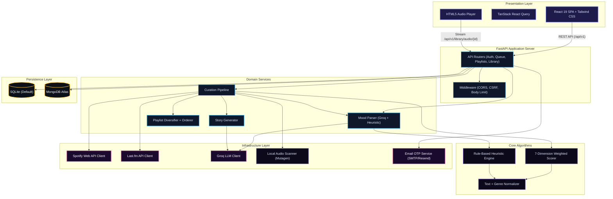

# 🎵 SoulTune — AI Music Curator from Mood Descriptions

[](https://opensource.org/licenses/MIT)
[](https://react.dev/)
[](https://fastapi.tiangolo.com/)
[](https://groq.com/)
[](https://www.docker.com/)

**SoulTune** is an AI-powered music curation engine that transforms freeform mood descriptions into scored, diversified, and explainable playlists. Instead of browsing catalogs or relying on opaque "recommended for you" lists, users describe how they feel — and SoulTune returns a ranked queue of tracks with transparent, evidence-based explanations for every selection.

Built with a modular FastAPI backend and a React 19 SPA frontend, SoulTune combines deterministic heuristic parsing, LLM-enhanced mood interpretation, multi-source candidate aggregation (Spotify, Last.fm, local library), weighted scoring, and intelligent diversification into a single cohesive pipeline.

Repository: https://github.com/Sriram4232/SoulTune

---

## 📑 Table of Contents

- [Core Problem Resolutions](#1-core-problem-resolutions)
- [Technology Stack](#2-technology-stack)
- [System Architecture](#3-system-architecture)
- [Curation Pipeline](#4-curation-pipeline-deep-dive)
- [Project Structure](#5-project-structure)
- [Prerequisites](#6-prerequisites)
- [Installation & Setup](#7-installation--setup)
- [Environment Configuration](#8-environment-configuration)
- [Deployment](#9-deployment)
- [Testing](#10-testing)
- [Contributing](#11-contributing)

---

## 1. Core Problem Resolutions

Music recommendation is traditionally either opaque (black-box collaborative filtering) or shallow (genre/artist similarity). SoulTune resolves these bottlenecks with an explainable, multi-layered approach:

### 1.1 Natural-Language Mood Parsing (Dual-Engine)

* **The Problem:** Users think in feelings and activities — _"something warm for a rainy evening"_ or _"high-energy Tamil mass hits for the gym"_ — but conventional systems require genre/artist selections or skip-based training.
* **The Solution:** SoulTune runs a **dual-engine parser**. First, a deterministic offline heuristic extracts mood, energy, valence, tempo ranges, genres, languages, activities, and negative constraints (e.g. _"no metal"_) from the text. If a Groq LLM API key is configured, the same text is sent to the model with the deterministic output as a baseline — the LLM enhances ambiguous mood/activity understanding while preserving all hard constraints. On LLM failure, the system transparently falls back to the deterministic interpretation:
  ```
  User: "calm indie vibes for late-night coding, no pop"
  → primary_mood: focused | energy: 0.52 | genres: [indie, lofi, ambient]
    excluded_genres: [pop] | activity: coding | tempo: 80–125 BPM
  ```

### 1.2 Weighted Multi-Dimensional Scoring

* **The Problem:** Simple genre matching ignores the nuanced difference between a calm jazz track and an intense jazz track. A "jazz" filter returns both.
* **The Solution:** Every candidate track is scored against the parsed mood profile using a **7-dimensional weighted formula**:

$$\text{Score} = 0.30 \times \text{Mood} + 0.20 \times \text{Energy} + 0.15 \times \text{Valence} + 0.10 \times \text{Genre} + 0.10 \times \text{Tempo} + 0.10 \times \text{Activity} + 0.05 \times \text{Popularity}$$

Unknown numeric features (energy, valence, tempo) are disclosed as neutral estimates rather than fabricated measurements. The score is never invented by an LLM — it is always computed from evidence.

### 1.3 Explainable Track Selection (No Black Boxes)

* **The Problem:** Streaming platforms say _"Because you listened to X"_ — users never learn _why_ a specific song was chosen for _this_ mood.
* **The Solution:** SoulTune generates a **vivid 3-sentence narrative** for each recommended track, built directly from scoring evidence (mood tag matches, energy proximity, genre alignment, activity fit). When Groq is available, narratives are LLM-enhanced; otherwise, a rich deterministic story generator constructs context-aware explanations using energy/valence ranges, genre labels, and activity mappings.

### 1.4 Intelligent Playlist Diversification

* **The Problem:** Naive top-N selection produces repetitive playlists: the same artist three times, all tracks in one genre, one dominant language.
* **The Solution:** After scoring, the **diversification engine** enforces per-artist, per-genre, and per-language caps. It removes duplicate/remastered variants (stripping parenthetical remaster tags and year suffixes), then applies energy-paced ordering so tracks flow naturally rather than clustering by score. A seeded jitter ensures variety across regenerations while a repeat-penalty demotes tracks from the previous queue.

### 1.5 Conversational Refinement with Context Retention

* **The Problem:** Traditional recommendation is stateless — users start over every time they want a small adjustment like _"make it a bit more upbeat"_.
* **The Solution:** SoulTune preserves the **structured mood profile** across refinements. Additive follow-up requests merge into the existing profile: new genres extend rather than replace, negative clauses accumulate, and only explicitly changed parameters are overwritten. The conversation context, original request, version history, and profile are persisted per queue.

### 1.6 Multi-Source Candidate Aggregation with Graceful Degradation

* **The Problem:** Relying on a single music API creates a single point of failure and limits catalog diversity.
* **The Solution:** The curation pipeline **concurrently queries** the local audio library, Spotify Web API, and Last.fm metadata — each with independent circuit breakers and bounded timeouts. If one provider is down, the remaining sources fill the queue. An unconfigured installation with no API keys falls back to the local `fallback_songs/` library with embedded metadata. A demo mock-track dataset is used only for completely empty, unconfigured installations and is never mixed into real queues.

---

## 2. Technology Stack

| Technology | Selection Rationale |
| :--- | :--- |
| **Python FastAPI (Backend)** | High-performance async routing, automatic OpenAPI generation, Pydantic-powered request validation, and native CORS/CSRF middleware. Handles curation math, auth, and media serving. |
| **React 19 + Vite 7 (Frontend)** | Modern SPA with concurrent rendering, hash-based client routing, and sub-second Hot Module Replacement during development. |
| **TanStack React Query** | Declarative server-state management with automatic caching, background refetching, and optimistic updates for playlists and queues. |
| **Tailwind CSS v4** | Utility-first styling via the Vite plugin — enables the cosmic dark-mode interface with gradients, glassmorphism, and micro-animations. |
| **Groq LLM API** | Ultra-low-latency inference for mood profile enhancement and narrative generation. Falls back to deterministic logic when unconfigured. |
| **Spotify Web API + Last.fm** | Dual external metadata and candidate sources with independent caching and circuit breakers. Both are optional. |
| **SQLite / MongoDB** | Dual-adapter persistence: local SQLite by default for zero-config development, MongoDB Atlas for production. Same storage interface, swappable via environment variable. |
| **Mutagen** | Embedded audio tag extraction (ID3, Vorbis, FLAC) for the local library scanner — no network dependency. |
| **Scrypt + HMAC OTP** | Password hashing with per-password random salts and browser-bound email OTP verification for secure, replay-resistant authentication. |
| **Docker (Multi-stage)** | Two-stage build: Node Alpine for frontend compilation, Python slim for the production image. Single-container deployment. |

---

## 3. System Architecture

SoulTune follows a decoupled **Client-Server Architecture** with a layered backend separating API routing, domain services, core algorithms, and infrastructure adapters:



---

## 4. Curation Pipeline Deep Dive

The end-to-end flow from user prompt to delivered playlist:


**Pipeline stages in detail:**

1. **Parse** — Load user preferences and any previous mood profile for refinements. Parse the description with the deterministic heuristic engine. If Groq is configured, validate the LLM's JSON interpretation against the Pydantic MoodProfile schema, preserving all explicit constraints.

2. **Gather** — Concurrently scan the local library (`mutagen` tag reading) and query Spotify + Last.fm APIs. Each external source has a cache layer and a circuit breaker to prevent cascade failures.

3. **Filter** — Apply hard exclusions: genre blacklist, artist exclusions, explicit-content rating, language constraints, instrumental-only, tempo range, decade, and avoided moods.

4. **Score** — Calculate the 7-weighted similarity score for every surviving candidate. Unknown features score a disclosed neutral 0.5 rather than a fabricated value.

5. **Diversify** — Cap per-artist (max 2), per-genre (⌈size/3⌉), and per-language repetition. Strip remastered/version suffixes for deduplication. Apply a repeat penalty for tracks from the previous queue.

6. **Order** — Sort by match score, then break ties using the activity's energy progression curve for a natural listening arc.

7. **Narrate** — Generate 3-sentence evidence-based stories. LLM-enhanced when available; rich deterministic stories (energy/valence atmosphere + activity context + genre/language detail) otherwise.

---

## 5. Project Structure

The project follows a clean, layered architecture with strict separation between presentation, API, domain logic, and infrastructure:

```text
SoulTune/
├── Backend/                          # Python FastAPI application
│   ├── app/
│   │   ├── api/                      # HTTP layer
│   │   │   ├── routes/               # Endpoint modules
│   │   │   │   ├── auth.py           # Register, login, OTP, guest, logout
│   │   │   │   ├── queue.py          # Mood queue generation & refinement
│   │   │   │   ├── playlists.py      # Collection CRUD, export, sharing
│   │   │   │   ├── library.py        # Local audio browsing & streaming
│   │   │   │   ├── account.py        # Profile & preference management
│   │   │   │   └── health.py         # System health & provider status
│   │   │   ├── app.py                # FastAPI application factory
│   │   │   ├── dependencies.py       # Shared deps (auth, CSRF, rate limiting)
│   │   │   └── middleware.py         # Body-limit & security middleware
│   │   ├── core/                     # Domain algorithms (zero I/O)
│   │   │   ├── models.py             # Pydantic schemas & MoodProfile
│   │   │   ├── scoring.py            # 7-weight scoring formula
│   │   │   ├── heuristics.py         # Rule-based NLP mood parsing
│   │   │   ├── normalization.py      # Genre, mood, language, activity maps
│   │   │   └── security.py           # Scrypt hashing & token utilities
│   │   ├── services/                 # Domain orchestration
│   │   │   ├── curation_service.py   # End-to-end pipeline coordinator
│   │   │   ├── mood_parser.py        # Groq + heuristic dual parser
│   │   │   ├── playlist_service.py   # Diversification & energy ordering
│   │   │   └── story_service.py      # LLM / deterministic story generator
│   │   ├── infrastructure/           # External adapters
│   │   │   ├── spotify.py            # Spotify Web API client & token mgmt
│   │   │   ├── lastfm.py             # Last.fm tag search & circuit breaker
│   │   │   ├── groq_client.py        # Groq LLM client & model fallback
│   │   │   ├── local_audio.py        # Filesystem scanner (Mutagen tags)
│   │   │   ├── mail.py               # SMTP / Resend email delivery
│   │   │   └── storage/              # Persistence adapters
│   │   │       ├── sqlite_store.py   # SQLite adapter (default)
│   │   │       └── mongo_store.py    # MongoDB adapter
│   │   ├── main.py                   # Uvicorn entrypoint
│   │   └── engine.py                 # Backward-compat re-export facade
│   ├── data/                         # Mock tracks & seed data
│   ├── tests/                        # Pytest suite
│   │   ├── test_api.py               # API endpoint integration tests
│   │   ├── test_engine.py            # Scoring & curation unit tests
│   │   ├── test_storage.py           # Storage adapter tests
│   │   ├── test_mongodb.py           # MongoDB-specific tests
│   │   └── test_mail.py              # Email delivery tests
│   ├── requirements.txt              # Python dependencies
│   └── .env.example                  # Environment variable template
├── Frontend/                         # React 19 SPA
│   ├── src/
│   │   ├── App.jsx                   # Root shell, routing, auth flow
│   │   ├── Dashboard.jsx             # Home feed & quick composer
│   │   ├── Workspace.jsx             # Playlist detail & track interaction
│   │   ├── Player.jsx                # Audio player provider & controls
│   │   ├── CollectionPages.jsx       # History, library, analytics views
│   │   ├── PublicPages.jsx           # Landing, auth, onboarding
│   │   ├── Settings.jsx              # Profile, preferences, account mgmt
│   │   ├── CosmicBackground.jsx      # Animated cosmic particle background
│   │   ├── LiquidCursor.jsx          # Interactive liquid cursor effect
│   │   ├── SongActions.jsx           # Track action menus (save, queue, etc.)
│   │   ├── components.jsx            # Shared UI primitives
│   │   ├── api.js                    # API client & CSRF handler
│   │   ├── main.jsx                  # React DOM mount point
│   │   └── styles.css                # Full design system stylesheet
│   ├── index.html                    # SPA entry HTML
│   ├── vite.config.js                # Dev server, proxy, Tailwind plugin
│   └── package.json                  # Node dependencies
├── fallback_songs/                   # Local audio library (mood-labeled folders)
│   ├── Energetic songs/
│   ├── Love songs/
│   ├── Vibe songs/
│   ├── melody songs/
│   ├── sad songs/
│   └── metadata.example.json         # Sidecar metadata template
├── docs/
│   └── ARCHITECTURE.md               # Detailed architecture documentation
├── Dockerfile                        # Multi-stage production build
├── start.ps1                         # PowerShell one-command launcher
├── pytest.ini                        # Test runner configuration
├── .gitignore
├── .dockerignore
└── README.md
```

---

## 6. Prerequisites

| Requirement | Version | Notes |
| :--- | :--- | :--- |
| **Python** | 3.10+ | Backend runtime |
| **Node.js** | 18+ | Frontend build toolchain |
| **npm** | 9+ | Comes with Node.js |
| **MongoDB** | _(optional)_ | Only if using MongoDB instead of default SQLite |
| **Groq API Key** | _(optional)_ | Enables LLM-enhanced mood parsing & stories |
| **Spotify API Credentials** | _(optional)_ | Enables Spotify catalog as a candidate source |
| **Last.fm API Key** | _(optional)_ | Enables Last.fm metadata enrichment |

> **Note:** SoulTune works fully offline with zero API keys. The local `fallback_songs/` library and deterministic heuristic engine provide a complete experience without any external dependencies.

---

## 7. Installation & Setup

### 7.1 Clone the Repository

```bash
git clone https://github.com/Sriram4232/SoulTune.git
cd SoulTune
```

### 7.2 Backend Setup

```bash
cd Backend

# Create and activate virtual environment
python -m venv .venv

# On Windows PowerShell:
.\.venv\Scripts\Activate.ps1

# On macOS/Linux:
source .venv/bin/activate

# Install dependencies
pip install -r requirements.txt
```

### 7.3 Frontend Setup

```bash
cd Frontend
npm install
```

### 7.4 Quick Start (PowerShell)

For a one-command setup that installs dependencies, builds the frontend, and launches the server:

```powershell
.\start.ps1 -Install
```

After first run, simply use:

```powershell
.\start.ps1
```

The application will be available at `http://127.0.0.1:8000`.

---

## 8. Environment Configuration

Copy the template and configure your environment:

```bash
cp Backend/.env.example Backend/.env
```

**Backend (`Backend/.env`):**

```env
# AI & Music APIs (all optional — app works without them)
GROQ_API_KEY=                           # Enables LLM-enhanced mood parsing
GROQ_MODEL=openai/gpt-oss-20b          # Primary LLM model
SPOTIFY_CLIENT_ID=                      # Spotify Web API credentials
SPOTIFY_CLIENT_SECRET=
LASTFM_API_KEY=                         # Last.fm metadata enrichment (via LASTFM_API_KEY env)

# Database (default: local SQLite, no config needed)
MONGODB_URI=                            # Set for MongoDB; leave empty for SQLite
DATABASE_PATH=data/curator.sqlite3      # SQLite file path

# Local Audio
LOCAL_MUSIC_DIR=                        # Empty defaults to fallback_songs/

# Authentication
OTP_SECRET=                             # Required: python -c "import secrets; print(secrets.token_urlsafe(48))"
MAIL_PROVIDER=smtp                      # smtp or resend
SMTP_HOST=smtp.gmail.com
SMTP_PORT=587
SMTP_USERNAME=you@example.com
SMTP_PASSWORD=                          # App password, not account password

# Security
COOKIE_SECURE=false                     # Set true behind HTTPS in production
ENVIRONMENT=development
ALLOWED_ORIGINS=http://localhost:5173,http://127.0.0.1:5173
```

---

## 9. Deployment

### Development (Two Terminals)

**Terminal 1 — Backend:**
```bash
cd Backend
source .venv/bin/activate
uvicorn app.main:app --reload --host 127.0.0.1 --port 8000
```

**Terminal 2 — Frontend:**
```bash
cd Frontend
npm run dev
```

Open `http://localhost:5173` — Vite proxies `/api` requests to the backend automatically.

---

### Production (Docker)

The multi-stage Dockerfile compiles the React frontend and bundles it with the FastAPI backend into a single lightweight image:

```bash
docker build -t soultune .
docker run -p 8000:8000 --env-file Backend/.env soultune
```

Open `http://localhost:8000` — FastAPI serves the built frontend on the same origin.

---

## 10. Testing

The project includes a comprehensive Pytest suite covering the API, curation engine, storage adapters, and email delivery:

```bash
cd Backend
source .venv/bin/activate
pytest
```

| Test Module | Coverage |
| :--- | :--- |
| `test_api.py` | API endpoint integration (auth, queue, playlists, library) |
| `test_engine.py` | Scoring formula, mood parsing, diversification, constraints |
| `test_storage.py` | SQLite adapter CRUD operations |
| `test_mongodb.py` | MongoDB adapter operations |
| `test_mail.py` | Email OTP delivery logic |

---

## 11. Contributing

Contributions are welcome! To get started:

1. **Fork** the repository
2. **Create** a feature branch (`git checkout -b feature/your-feature`)
3. **Implement** your changes following the existing architecture layers
4. **Test** locally with `pytest` and verify the frontend builds
5. **Open** a pull request with a clear summary of changes

---

<p align="center">
  <strong>A LITTLE MORE MUSIC. A LITTLE MORE YOU.</strong><br/>
  <em>Made for your moment ✦</em>
</p>
